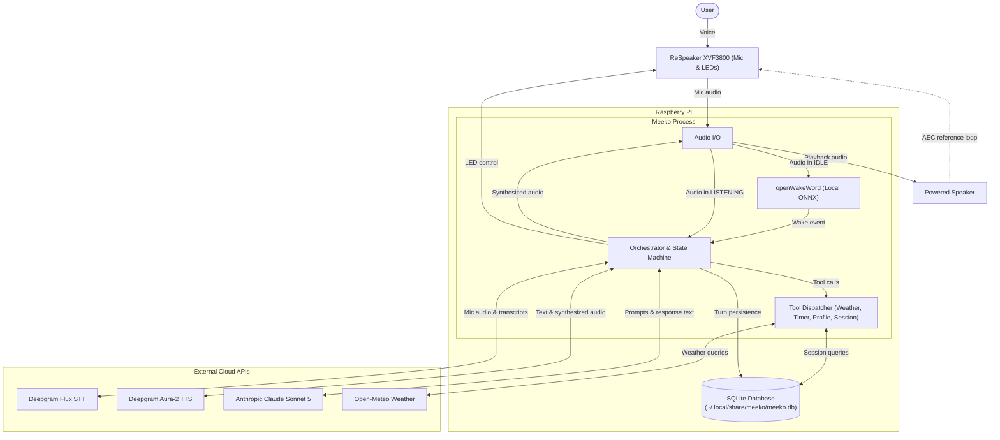
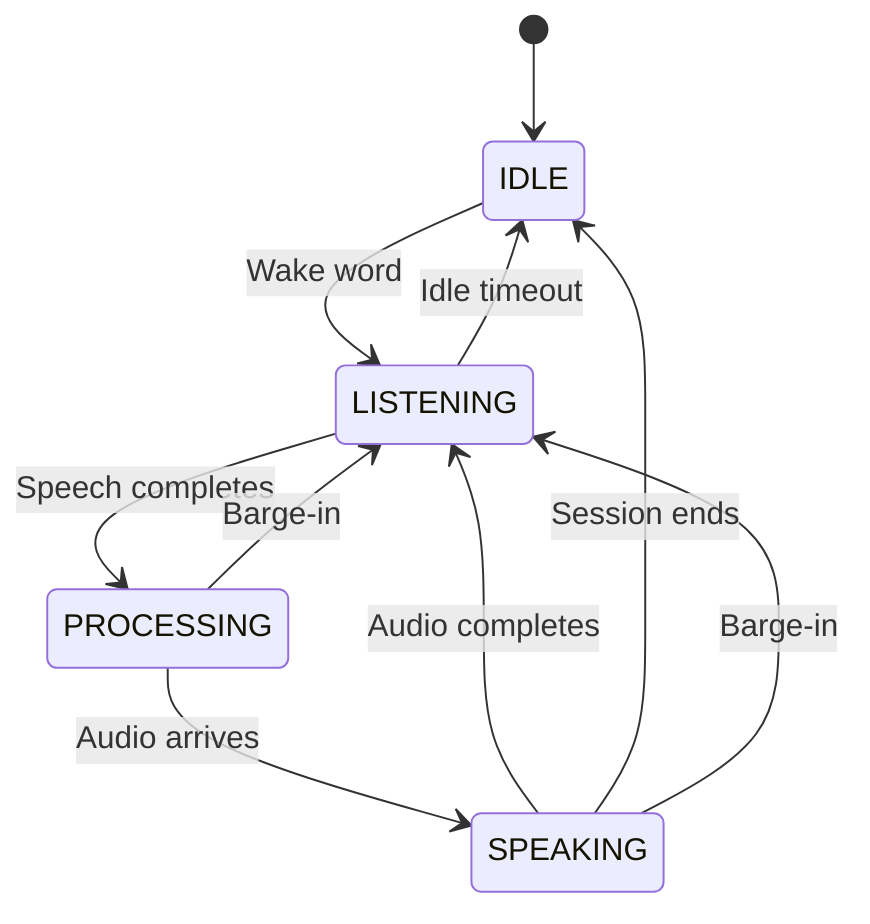
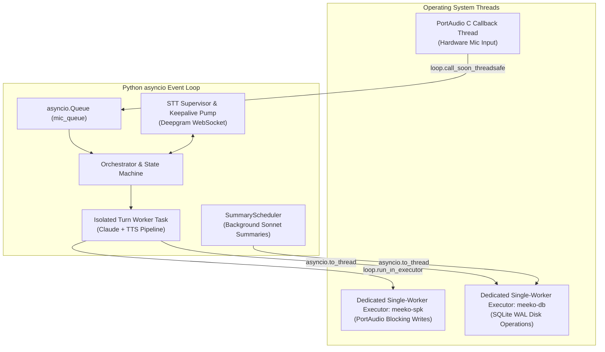

# Meeko Architecture

How Meeko works under the hood — the components, the data flow, and the design decisions behind them. If you just want to install and run Meeko, see [README.md](../README.md) instead.

## 1. Overview

Meeko is an open-source, personal voice assistant designed as a dedicated tabletop brainstorming partner. Unlike command-and-control smart speakers (Siri, Alexa) or scripted customer support bots, Meeko is built for extended, wandering, technical discussions — conversations where you might pause for minutes at a time to think, resume without a wake word, or return days later to pick up a previous thread.

While it readily handles quick daily utilities (timers, weather, one-shot questions), every layer of the architecture is optimized around the long-conversation problem.

### Core Architectural Pillars

1. **Massive Context at Low Cost**:
   Brainstorming sessions naturally grow to 50k–150k tokens. Meeko communicates directly with Anthropic's Claude API to leverage **prompt caching** (90% cost reduction on conversation prefixes) and **server-side compaction** (summarizing early context when approaching token ceilings) while maintaining an unabridged verbatim record in local SQLite.

2. **Conversational Fluidity & True Interruption**:
   Voice brainstorming demands natural pacing. Meeko couples semantic end-of-turn detection (Deepgram Flux) with on-device **hardware Acoustic Echo Cancellation (AEC)** on the ReSpeaker XVF3800. This enables true barge-in — you can speak over the assistant at any moment without the assistant interrupting itself on its own echo.

3. **Voice-Native Session Persistence**:
   Meeko has no screen or companion phone app. Session boundaries and recall are managed entirely by voice through Claude tool-use (`new_session`, `end_session`, `list_sessions`, `load_session`). Completed sessions are automatically summarized in the background and indexed into SQLite FTS5, allowing you to recall prior discussions naturally (*"Let's go back to our discussion on database migrations"*).

4. **Local Hardware Privacy with Cloud Intelligence**:
   Running on a Raspberry Pi, Meeko uses an on-device ONNX model (openWakeWord) to gate all audio in `IDLE`. No audio or ambient room sound leaves your local network until you explicitly say *"Hey Meeko"*.

---

## 2. Architecture Overview



---

## 3. Hardware & Verified Configurations

In principle, Meeko is hardware-agnostic — any host running Python 3.14+ and any audio interface supported by PortAudio/PyAudio will work.

In practice, the codebase has been verified on two specific setups:

| Setup | Environment | Audio Strategy |
|---|---|---|
| **Raspberry Pi 5 + ReSpeaker XVF3800 + Powered Speaker** | **Primary Appliance Target** | **Hardware AEC**: Full-duplex audio; mic stays hot during playback for natural barge-in. |
| **macOS Laptop (Built-in Mic & Speakers)** | **Development Workstation** | **Software Mic-Muting**: Simplex audio (`mute_mic_while_speaking = true`); prevents self-interruption on devices without hardware AEC. |

### The Reference Appliance Setup

The author's primary tabletop setup is built around the **Raspberry Pi 5** and the **Seeed Studio ReSpeaker XVF3800**:

- **Hardware Acoustic Echo Cancellation (AEC)**:
  The XVF3800 features an onboard XMOS DSP running real-time 4-microphone beamforming, noise suppression, and AEC. **The powered speaker must plug directly into the XVF3800's 3.5mm analog jack**, not the Pi's audio output. The onboard DSP uses this analog output as its far-end reference signal to subtract speaker audio before passing clean voice frames to Meeko.
- **Detailed Setup Walkthrough**:
  One-time AEC double-talk sensitivity tuning (`PP_DTSENSITIVE`), Linux USB permissions (`udev` rules for non-root LED control), and systemd boot service setup are documented in [docs/raspberry-pi-setup.md](raspberry-pi-setup.md).

### Other Configurations

Other hardware (e.g., Raspberry Pi 4, standard USB microphones, Linux desktops) should work, but has not been tested. If using audio hardware without on-device echo cancellation, set `mute_mic_while_speaking = true` in `meeko.toml` under `[audio]` to avoid self-interruption.

---

## 4. Component Details

[meeko/main.py](../meeko/main.py) serves as the composition root: `run()` constructs every component and injects dependencies. The core orchestration logic — state management, mic frame routing, turn queues, idle silence monitors, and post-turn session hooks — lives in [meeko/orchestrator/](../meeko/orchestrator/). The STT connection lifecycle (backoff, reconnection, keepalives) is isolated in [meeko/stt_supervisor.py](../meeko/stt_supervisor.py).

### 4.1 Audio I/O Layer (`meeko/audio_io.py`, `speaker.py`)

Audio hardware interaction is built on PyAudio / PortAudio. Unlike high-level libraries (like `sounddevice`), PortAudio provides strict control over native hardware channel counts without silent OS-level sample rate or channel conversions.

Key responsibilities of the local audio layer:
- **Left-Channel AEC Extraction**: The ReSpeaker XVF3800 sends a 2-channel interleaved PCM stream over USB, but only the left channel (channel 0) contains the hardware AEC-processed audio. `AudioIO._left_channel` extracts this stream before feeding it into the application.
- **Mono-to-Stereo Playback Expansion**: Deepgram TTS outputs mono audio, while the XVF3800 analog DAC expects stereo. `AudioIO._mono_to_stereo` duplicates mono chunks into interleaved stereo frames.
- **Thread-Safe Async Bridging**: PortAudio runs low-level C callback threads. `AudioIO` safely bridges captured PCM frames into Python's `asyncio.Queue` via `loop.call_soon_threadsafe()`.
- **Non-Blocking Playback**: Playback writes (`_write_stream`) run in dedicated thread pool executors so audio I/O never blocks Meeko's async event loop.
- **Instant Buffer Purging**: [`Speaker.abort()`](../meeko/speaker.py) immediately purges the output buffer and stops playback the moment a barge-in occurs.

### 4.2 Deepgram STT (Flux)

Meeko uses Deepgram's **Flux** model for streaming transcription and semantic turn detection. Unlike traditional STT that relies on static silence thresholds, Flux uses conversational context to detect when a user has naturally completed a turn.

**Key Events:**
- `StartOfTurn`: User has begun speaking. Handled immediately by [`SttEventRouter`](../meeko/orchestrator/stt_events.py) to cancel active silence timers in `LISTENING` or trigger instant barge-in if `SPEAKING` or `PROCESSING`.
- `EndOfTurn`: User has finished their thought. Carries the finalized transcript and pushes it onto `turn_queue` to drive Claude.

The router continuously drains the WebSocket event stream synchronously. Backpressure here would park the WebSocket receive loop, starve ping/pong keepalives, and trigger a 1011 connection drop mid-conversation.

### 4.3 Claude API (Direct Client)

Meeko calls the Anthropic Messages API directly rather than using managed voice aggregators. This direct control enables prompt caching, server-side context compaction, and custom tool dispatch.

- **Model**: `claude-sonnet-5` (used for both conversation turns and background session summaries).
- **Prompt Caching**:
  Meeko stamps `cache_control` on the system prompt prefix and dynamically slides a cache breakpoint to the tail of the message array on every turn. The cached stable prefix includes:
  1. Local timestamp block (`_date_block`)
  2. Approximate home coordinates block (`_location_block`, if configured)
  3. Active profile persona prompt (`_profile_prompt`)
- **Server-Side Compaction**:
  Enabled via `betas=["compact-2026-01-12"]` with automatic trigger thresholds (`[claude] compaction_trigger_tokens`, default `150000`). When Sonnet approaches the token ceiling, the API automatically replaces early conversation history with an internal summary block. Meeko preserves this block in memory so Claude does not re-summarize, while maintaining verbatim transcripts in SQLite.
- **Web Search & Nested Tool Invariant**:
  Exposes Anthropic's `web_search_20260209` server tool (capped at `web_search_max_uses` attempts per turn). When Claude performs searches, it often nests them inside a `code_execution` container.

  > [!IMPORTANT]
  > When serializing assistant message blocks for replay, **never drop the `caller` field** on nested tool results. Without `caller`, the Anthropic API cannot match searches to their parent execution container and rejects subsequent turns with a `400 Bad Request`.

### 4.4 Deepgram TTS (Aura-2)

Speech synthesis is handled by Deepgram Aura-2 over a persistent WebSocket connection. As Claude streams tokens, Meeko batches them into phrase/sentence chunks and streams text to Deepgram, playing synthesized PCM chunks with sub-200ms time-to-first-audio. Voices are configured per profile (`voice = "mars"`, `"andromeda"`, etc.).

### 4.5 Tool Architecture & Session Intents

Meeko exposes external capabilities and session-management intents to Claude as native tool definitions registered through `ToolDispatcher`:

- **Timers** ([meeko/tools/timer.py](../meeko/tools/timer.py)): Natural language timers (`set_timer`), managed by an async background task loop.
- **Weather** ([meeko/tools/weather.py](../meeko/tools/weather.py)): Real-time forecast queries (`get_weather`) powered by Open-Meteo (free, no API key required), defaulting to configured home coordinates or geocoding requested locations.
- **Profile Switching** ([meeko/tools/profile.py](../meeko/tools/profile.py)): Dynamic persona changes (`switch_profile`, `list_profiles`) generated dynamically from configured profile descriptions.
- **Session Management** ([meeko/tools/session.py](../meeko/tools/session.py)): Conversation lifecycle control (`new_session`, `end_session`, `list_sessions`, `load_session`).

Exposing session control as tools rather than a separate intent classifier unifies conversational handling: Claude determines user intent from context, confirms verbally when appropriate, and invokes the tool via standard `tool_use` blocks.

| Session Tool | Behavior |
|---|---|
| `end_session` | Finalizes the current SQLite session, transitions state to `IDLE`, and re-arms the wake word detector. |
| `new_session` | Finalizes the current session, allocates a fresh SQLite session row, resets in-memory history, and stays in `LISTENING`. |
| `list_sessions(query, since, until)` | BM25-ranked full-text search across SQLite `title`, `summary`, and `transcript`, filtered by date. Returns matching session IDs and metadata to Claude. |
| `load_session(id)` | Swaps active conversational context to a prior historical session (see below). |

**The `load_session` Context-Swap**:
`load_session` is unique because it rewrites Claude's active context. To ensure natural voice delivery, the transition is executed as a deferred post-turn hook:
1. When called, the tool handler records the target session ID and returns metadata so Claude can verbally acknowledge the switch (*"Resuming our project discussion from Tuesday"*).
2. Once speech playback finishes in `SPEAKING`, [`apply_post_turn_session_change`](../meeko/orchestrator/session_change.py) kicks off background summarization of the abandoned session.
3. It loads the target transcript from SQLite, swaps Claude's in-memory message array via `claude.load_history()`, and rebinds the client to the restored session row. Subsequent turns hit Claude's prompt cache with the restored history.

**Prompt Directives for Lifecycle Tools**:
Because session tools mutate conversational state, each profile's system prompt gives Claude clear behavioral boundaries:
- **Silent Teardown**: `end_session` is called silently when the user clearly signals intent to finish (*"that's enough for today"*, *"goodnight"*, *"Meeko stop"*), turning off LEDs without speaking. Ambiguous statements (*"stop interrupting me"*, *"that's enough about X, let's talk about Y"*) do not trigger session teardown.
- **Verbal Confirmation**: Destructive or context-shifting operations (`load_session` to abandon active history, `new_session` to discard the current thread) require Claude to confirm verbally before invocation.
- **Natural Recall**: `list_sessions` is called whenever the user asks about past topics or wants to pick up an old conversation.

### 4.6 Wake-Word Gating (`meeko/wake_word.py`, `mic_pump.py`)

In `IDLE`, mic audio is evaluated purely on-device by [openWakeWord](https://github.com/dscripka/openWakeWord) running in an ONNX runtime. No audio leaves the local network until the wake phrase is detected.

- **One-Shot Gating**: Saying *"Hey Meeko"* transitions the state machine to `LISTENING`. Once awake, follow-up turns do not require the wake word; Meeko stays in `LISTENING` until an idle timeout or explicit `end_session`.
- **Zero Audio Leakage**: [`MicPump`](../meeko/mic_pump.py) inspects the state on every 50ms audio chunk. In `IDLE`, frames are sent exclusively to the local openWakeWord detector and discarded. The specific audio chunk that triggers the wake detector is dropped rather than forwarded to STT, ensuring the wake phrase itself is not transcribed as part of the user's turn.

### 4.7 Profiles and Idle Behavior

Meeko's persona and conversational pacing are configured via `[profiles.<name>]` tables in `meeko.toml`. Profiles bundle four attributes:
1. **Persona Prompt**: The system prompt injected into Claude's cached prefix.
2. **Voice**: Deepgram Aura-2 voice identifier (e.g., `asteria`, `mars`).
3. **Tool Description**: Guidance instructing Claude when to switch to this profile.
4. **Idle Timing Windows**: Pacing parameters that control how Meeko behaves during silence.

```toml
[profiles.query]
prompt = "You are a concise, helpful assistant. Answer briefly."
voice = "asteria"
description = "Quick, factual questions and one-shot commands."
idle_timeout_seconds = 5.0   # Closes silently after 5s of silence

[profiles.conversation]
prompt = "You are a thoughtful technical brainstorming partner..."
voice = "mars"
description = "Deep, multi-turn brainstorming and extended discussion."
idle_timeout_seconds = 60.0  # Waits 60s, then asks: "Still thinking, or wrap up?"
idle_prompt = "Still thinking, or should we wrap up?"
idle_close_seconds = 20.0
idle_close_text = "Ending the session now. Talk later."
```

**Silence Windows**:
- **Post-Wake Timeout** (`post_wake_timeout_seconds`, default `15.0s`): Covers the silence gap if someone says *"Hey Meeko"* but never follows up with a question. Closes silently back to `IDLE`.
- **Post-Turn Idle Window**: Managed by [`IdleController`](../meeko/orchestrator/idle.py). After speech finishes, it monitors silence according to the active profile. In `conversation` mode, it speaks a gentle check-in prompt before eventually closing. Any user speech (`StartOfTurn`) or barge-in instantly cancels the pending idle timer.

### 4.8 Session Manager & Background Scheduling (`meeko/session_summary.py`)

Session teardown and summarization are designed to never block the conversational loop:
- **Immediate Turn Persistence**: Turns are written to SQLite immediately on completion, not buffered or saved only at session end.
- **Fire-and-Forget Summarization**: When a session ends, [`SummaryScheduler`](../meeko/session_summary.py) fires an asynchronous background task using Claude to generate a concise title and summary. These are indexed into SQLite FTS5 for voice recall.
- **Startup Backfill**: On startup, `SummaryScheduler` scans SQLite for any historical sessions that terminated abnormally without a summary (e.g., power loss) and summarizes them in the background.

### 4.9 LED Controller & Visual State Mirror (`meeko/leds.py`)

On a screenless hardware appliance, the ReSpeaker XVF3800's circular WS2812 LED ring serves as the primary visual interface.

To guarantee that physical indicators never desynchronize from the application, [`StateManager`](../meeko/orchestrator/state.py) is the sole writer, updating the LED ring synchronously on every state transition:

| State | LED Appearance | Meaning |
|---|---|---|
| **`IDLE`** | Off | Local wake-word gating; no audio leaves device. |
| **`LISTENING`** | Solid cyan | Awake and waiting for speech. |
| **`LISTENING_ACTIVE`** | Bright cyan | Actively detecting incoming speech. |
| **`PROCESSING`** | Blue breathing pulse | Waiting on Claude tokens or web search. |
| **`SPEAKING`** | Solid green | Audio playing through speaker. |
| **Error** | Red breathing pulse (~3s) | Turn failed; returns immediately to `LISTENING`. |

LED control communicates over direct USB vendor control transfers via `libusb` / `pyusb` without requiring root permissions (via `scripts/99-meeko-xvf3800.rules`). It is automatically disabled on unsupported hosts or when `led_disabled = true`.

---

## 5. Conversation Flow

### 5.1 State Machine



*(Note: When user speech is actively detected during `LISTENING`, Meeko enters an internal `LISTENING_ACTIVE` sub-state to drive live visual indicators like the brighter cyan LED ring, before transitioning to `PROCESSING` once `EndOfTurn` fires.)*

### 5.2 Normal Turn Lifecycle

A successful conversational turn moves through five pipelined stages:

1. **Turn Ingestion (`LISTENING ➔ PROCESSING`)**:
   Deepgram STT emits `EndOfTurn` with the finalized user transcript. The state machine transitions to `PROCESSING` (blue breathing LED pulse), and the transcript is queued for [`TurnWorker`](../meeko/orchestrator/turn_worker.py).

2. **Tool Execution Loop**:
   Claude is invoked with the conversation context and active tool definitions. If Sonnet emits `tool_use` blocks (e.g., checking weather or listing prior sessions), `ToolDispatcher` executes the handlers synchronously, appends `tool_result` blocks, and re-invokes Claude until a final text reply begins streaming.

3. **Concurrent Token & Audio Streaming (`PROCESSING ➔ SPEAKING`)**:
   Text tokens stream from Claude directly into Deepgram TTS without waiting for the full response to finish. When the first synthesized audio chunk arrives at the speaker, the state transitions to `SPEAKING` (solid green LED), giving the assistant sub-second perceived response latency.

4. **Turn Persistence**:
   Once speech generation completes cleanly, the user utterance and full assistant turn (including any tool calls and compaction tokens) are written to:
   - In-memory message array (for ongoing conversational context)
   - On-disk SQLite `turns` table (the immutable persistent record)

5. **Post-Turn Transition (`SPEAKING ➔ LISTENING` or `IDLE`)**:
   `TurnWorker` executes the deferred session change hook ([`apply_post_turn_session_change`](../meeko/orchestrator/session_change.py)):
   - If `end_session` was called: finalizes the session, transitions state to `IDLE` (LEDs off), and re-arms the on-device wake word.
   - Otherwise: transitions back to `LISTENING` (solid cyan LED) and arms the profile's post-turn silence timer.

### 5.3 Barge-In

In natural brainstorming conversations, people frequently interrupt — either talking over the assistant or changing their mind while the assistant is thinking. Meeko treats interruptions as first-class events: speaking at any point immediately cuts audio playback, cancels in-flight LLM generation, and pivots to the user's new thought without requiring a wake word.

When `StartOfTurn` fires during `SPEAKING` or `PROCESSING`, Meeko executes four immediate actions:
1. **Purge audio buffer**: Abort speaker output and flush the hardware ring buffer immediately so sound cuts off with zero audible lag.
2. **Cancel cloud generation**: Drop the in-flight Claude stream and discard any partially generated reply so tokens aren't wasted.
3. **Cancel turn sub-task**: Cancel the isolated asyncio turn task without interrupting the main orchestrator loop.
4. **Reset state**: Transition synchronously to `LISTENING` (bright cyan LED) so the incoming speech is processed as a fresh turn.

#### Key Architectural Challenges

1. **Barging in while thinking (`PROCESSING`)**:
   Users interrupt during the silent thinking gap (Claude TTFT + TTS synthesis, often >1s) just as often as during audible speech. To keep visual cues honest, Meeko defers entering `SPEAKING` until the first audio byte actually reaches the speaker. If a user interrupts during this gap, Meeko treats it as an identical barge-in, aborting generation before the reply ever becomes audible.

2. **Zero-Latency Silence (Buffer Purging)**:
   Simply stopping the audio stream leaves up to 500ms of audio sitting in the hardware/driver output buffer, causing the assistant to awkwardly finish its syllable. `Speaker.abort()` explicitly flushes the hardware ring buffer to achieve instantaneous, crisp silence.

3. **Concurrency & Sub-Task Cancellation**:
   In Python asyncio, cancelling a long-running worker task would kill the assistant. In Meeko, [`TurnWorker`](../meeko/orchestrator/turn_worker.py) runs each Claude+TTS turn as an isolated sub-task (`asyncio.create_task`). On barge-in, `request_barge_in()` cancels *only* that sub-task and synchronously resets the state machine to `LISTENING`. A custom cancellation flag distinguishes a user barge-in from an application shutdown.

*(Note: Hardware AEC on the ReSpeaker XVF3800 subtracts speaker output from mic input so playback never triggers false barge-ins; see §4.1 for fallback mic-muting on devices without AEC.)*

---

## 6. Session Persistence & Voice Recall

Because Meeko has no graphical display, historical sessions must be accessible and resumable entirely through natural speech. Meeko pairs immediate, crash-resilient SQLite storage with asynchronous Claude summarization and FTS5 full-text indexing.

### 6.1 SQLite Data Model

```sql
CREATE TABLE sessions (
    id            TEXT PRIMARY KEY,     -- UUID
    profile_name  TEXT NOT NULL,        -- profile active when last used
    title         TEXT,                 -- generated at session end
    summary       TEXT,                 -- generated at session end
    created_at    TEXT NOT NULL,        -- ISO 8601 UTC
    last_active   TEXT NOT NULL         -- ISO 8601 UTC
);

CREATE TABLE turns (
    id          INTEGER PRIMARY KEY AUTOINCREMENT,
    session_id  TEXT NOT NULL REFERENCES sessions(id),
    role        TEXT NOT NULL,          -- 'user' or 'assistant'
    content     TEXT NOT NULL,          -- JSON string or assistant tool blocks
    timestamp   TEXT NOT NULL           -- ISO 8601 UTC
);

CREATE INDEX idx_turns_session ON turns(session_id, id);

-- Standalone FTS5 table (not external-content, because sessions.id is a UUID).
-- Populated once per session upon background summarization.
CREATE VIRTUAL TABLE sessions_fts USING fts5(
    session_id UNINDEXED,
    title,
    summary,
    transcript                          -- Flattened turn text for keyword fallback
);
```

### 6.2 Immediate Turn Persistence

Every conversational turn is written to SQLite immediately upon completion — never buffered in memory and never deferred to session teardown. This ensures:
- **Zero data loss**: If Meeko loses power mid-session, all completed turns are preserved.
- **Single source of truth**: On-disk transcripts remain the permanent record, even after Claude's in-memory message array undergoes server-side compaction.

### 6.3 End-of-Session Summarization

When a session concludes, Meeko invokes Claude to synthesize a concise `{title, summary}` pair from the full on-disk transcript:

- **Model Choice (`claude-sonnet-5`)**:
  Summaries are generated with Sonnet rather than a smaller model like Haiku. High-quality titles and summaries directly determine voice recall accuracy — a weak summary causes FTS to miss when the user asks to *"go back to the database discussion"*. Because summarization runs in the background, latency is invisible to the user.
- **FTS5 Fallback Indexing**:
  In addition to the generated title and summary, the flattened transcript is indexed into `sessions_fts.transcript`. This provides a search fallback if a user remembers a specific niche keyword that the summarizer did not highlight in its summary.
- **Background Scheduling (`meeko/session_summary.py`)**:
  [`SummaryScheduler`](../meeko/session_summary.py) manages summarization tasks completely decoupled from the real-time turn loop. It tracks in-flight jobs, automatically backfills unsummarized sessions on startup (recovering from crashes), and guarantees clean task draining via `aclose()` before database shutdown.

### 6.4 Voice Resume Flow

The resume workflow is driven entirely by Claude calling the `list_sessions` and `load_session` tools:

1. **User Request**: The user asks to revisit a past discussion (*"Let's go back to our todo app project"* or *"What did we talk about yesterday?"*).
2. **Session Search (`list_sessions`)**:
   Claude invokes `list_sessions`:
   - **Keyword searches**: Queries `sessions_fts` using BM25 ranking (weighted so title and summary matches outrank raw transcript matches).
   - **Date range searches (`since` / `until`)**: Queries the primary `sessions` table by UTC `last_active`. Querying `sessions` directly ensures that fresh conversations that have not yet finished background summarization are still discoverable.
3. **Verbal Confirmation**:
   Claude confirms the target verbally (*"I found the todo app conversation from Tuesday — would you like to pick that up?"*).
4. **Context Swap (`load_session`)**:
   Upon user confirmation, Claude invokes `load_session(id)`. The post-turn hook:
   - Triggers background summarization for the current abandoned session.
   - Loads the target transcript from SQLite.
   - Swaps Claude's in-memory message array via `claude.load_history()` and rebinds the client.
5. **Seamless Continuation**:
   The conversation continues in the restored context, benefiting immediately from prompt caching on subsequent turns (incurring only a one-time cache-write cost on the first turn).

---

## 7. Concurrency & Threading Architecture

Real-time voice processing on a low-power host like the Raspberry Pi 5 requires strict isolation between blocking hardware/disk I/O and the asynchronous event loop. An event loop stalled for even 100ms causes audio buffer underruns, dropped WebSocket frames, or audible speech stutter.



### 7.1 Thread Isolation Boundaries

1. **Hardware Mic Input (PortAudio C Thread ➔ Async Queue)**:
   PortAudio captures microphone frames in low-level C callback threads. To prevent blocking the audio driver, callbacks perform zero processing: `AudioIO._mic_callback` extracts the left AEC channel and immediately hands off the 50ms chunk to Python's event loop via `loop.call_soon_threadsafe(self.mic_queue.put_nowait, mono)`.

2. **Hardware Speaker Output (Dedicated `meeko-spk` Executor)**:
   PortAudio's `write_stream` is a synchronous, blocking C function. Calling it from Python's general `asyncio.to_thread` pool is unsafe: PortAudio's stream API is strictly single-threaded, and if an utterance task is cancelled during barge-in while a write is in flight, a subsequent write on another worker thread would call `write_stream` concurrently, corrupting the stream or crashing ALSA. Meeko routes all speaker writes through a dedicated single-worker executor (`ThreadPoolExecutor(max_workers=1, thread_name_prefix="meeko-spk")`), guaranteeing strict FIFO serialization regardless of asyncio task cancellations.

3. **Database Disk I/O (Dedicated `meeko-db` Executor)**:
   SQLite operations — inserting turns, updating session timestamps, and executing FTS5 full-text searches — involve synchronous disk access. Meeko isolates SQLite calls inside a dedicated single-worker executor (`ThreadPoolExecutor(max_workers=1, thread_name_prefix="meeko-db")`). This eliminates database lock contention, guarantees sequential transaction writes under SQLite WAL mode, and ensures disk writes never stall voice streaming.

4. **Event Loop Hygiene**:
   The main asyncio event loop runs purely non-blocking coroutines: WebSocket frame routing, state machine transitions, and Claude token parsing. Running Meeko with `PYTHONASYNCIODEBUG=1` validates that no callback holds the event loop for 100ms or longer.

---

## 8. Appliance Resilience & Fault Tolerance

As an always-on tabletop appliance without a keyboard or monitor, Meeko must run unattended for weeks without manual restarts, surviving network dropouts, upstream API errors, and sudden power cuts.

### 8.1 Network & STT Supervision (`meeko/stt_supervisor.py`)

The connection to Deepgram's streaming STT endpoint is governed by [`STTSupervisor`](../meeko/stt_supervisor.py), which handles transient network outages transparently:

- **Exponential Backoff with Jitter**:
  When a WebSocket disconnects unexpectedly (e.g., DNS blip, server 1011 drop), the supervisor retries with exponential backoff: `(0.5s, 1s, 2s, 4s, 8s, 16s, 30s)`. A single failure logs a full traceback; prolonged outages log a single warning per attempt to prevent log flooding.
- **Audio Grace Buffering (`RECONNECT_GRACE_S = 10s`)**:
  During transient network hiccups, Meeko keeps capturing mic frames for up to 10 seconds. If connection is restored within the grace window, speech queued during the blip is delivered to Deepgram without losing the user's turn. If the outage exceeds 10 seconds, the mic queue is drained and audio capture is paused until the connection stabilizes.
- **Server Keepalive Heartbeats**:
  Deepgram STT requires periodic activity to prevent idle disconnections. When no mic audio is actively streaming (such as in `IDLE`), `keepalive_pump` sends a JSON `KeepAlive` text frame every 5 seconds.

### 8.2 Crash-Proof Turn Persistence & Startup Backfill

- **Zero-Data-Loss Invariant**:
  Because turns are committed to SQLite immediately upon completion (§6.2), a sudden power pull never corrupts historical transcripts. SQLite runs with `PRAGMA synchronous = NORMAL` and `PRAGMA journal_mode = WAL`, providing crash durability with low write overhead.
- **Orphaned Session Backfill**:
  If a power outage occurs while a conversation is active, the session will lack a summary and title. On boot, [`SummaryScheduler.backfill()`](../meeko/session_summary.py) queries for unfinalized historical sessions, summarizes them asynchronously with Claude, and indexes them into FTS5 before the user wakes the device.
- **Clean Shutdown Draining**:
  When receiving `SIGINT` or `SIGTERM`, Meeko cancels the active turn, drains the background summary scheduler (`SummaryScheduler.aclose()`), stops PortAudio streams, and closes the database connection cleanly before exiting.

### 8.3 Non-Fatal Turn Failures

Turn-level errors never crash the application:
- **API & Network Exceptions**: If Anthropic times out, Deepgram TTS fails, or Open-Meteo returns an error, `TurnWorker` catches the exception, logs it, pulses the LED ring in red (breathing error state for ~3 seconds), and returns the state machine cleanly to `LISTENING`.
- **Tool Error Insulation**: All tool handlers (`set_timer`, `get_weather`, `list_sessions`) catch internal exceptions and return friendly natural-language error strings to Claude rather than raising. Claude can then explain the problem to the user (*"I couldn't reach the weather service just now"*).
- **Process Supervision (`systemd`)**:
  In the rare event of an unrecoverable failure (e.g. fatal hardware disconnect), `meeko` exits non-zero. A systemd unit configured with `Restart=always` and `RestartSec=2` reboots the process into a clean `IDLE` state.

---

## 9. Key Decisions

### 1. Direct Claude API vs. Managed Voice Platforms

All-in-one managed voice services (such as Deepgram's Voice Agent API or OpenAI's Realtime API) package STT, LLM inference, and TTS into a single WebSocket connection. While convenient, they obscure the underlying LLM call and strip away critical context management features:

- **Prompt Caching**: Long brainstorming sessions regularly reach 50k–150k tokens. Direct Anthropic API calls allow Meeko to stamp `cache_control` breakpoints, slashing input token costs by ~90% on cached prefixes.
- **Server-Side Compaction**: Using the Anthropic compaction beta (`betas=["compact-2026-01-12"]`), Sonnet automatically summarizes earlier conversational turns when approaching token thresholds, keeping sessions running indefinitely without manual context clipping.
- **Verbatim Session Persistence**: Managed services handle history ephemerally. Direct control allows Meeko to commit every raw turn to local SQLite immediately upon completion, preserving an immutable transcript even after in-memory compaction.

### 2. Deepgram Flux STT vs. Local Whisper & Silence VAD

Many open-source voice assistants run Whisper (or `faster-whisper`) paired with a local Voice Activity Detector (such as Silero VAD) to avoid recurring cloud STT costs. 

For a brainstorming assistant, traditional VAD breaks conversational pacing. Standard VAD relies on fixed silence windows (e.g. 500–800ms) to detect turn completion. In deep, reflective discussions, people routinely pause mid-thought to think, causing standard VAD to prematurely cut them off and trigger an unwanted response. 

Deepgram Flux performs **semantic end-of-turn detection** in the cloud. Rather than relying purely on silence timers, it analyzes the grammatical and conversational completeness of the incoming speech, cleanly distinguishing between a thoughtful pause and an actual finished turn.

### 3. Hardware Echo Cancellation via 3.5mm Jack vs. Software AEC

The ReSpeaker XVF3800's onboard XMOS DSP chip performs hardware-level acoustic echo cancellation (AEC), noise suppression, and 4-microphone beamforming. 

For hardware AEC to work, the DSP must receive the exact "far-end" reference signal being played into the room so it can subtract it from the microphone stream in real time. **Plugging the powered speaker directly into the XVF3800's 3.5mm analog jack provides this reference signal in hardware.** 

Plugging speakers into the Raspberry Pi's audio output, an HDMI display, or a Bluetooth speaker bypasses the DSP chip. Without a reference signal, the microphones capture the assistant's own voice as incoming speech, resulting in false barge-in triggers, feedback loops, and hallucinated user turns. Offloading AEC to dedicated DSP hardware also frees the Pi's CPU from the heavy latency and processing overhead of running software echo cancellation algorithms.

### 4. On-Device Wake-Word Gating vs. Continuous Cloud Streaming

A developer new to voice systems might wonder why Meeko doesn't simply leave a streaming STT connection open to the cloud 24/7 and detect *"Hey Meeko"* directly in the transcription stream.

Continuous cloud audio streaming has two major drawbacks for a tabletop assistant:
- **Room Privacy**: An open microphone streaming ambient room sound to a third-party cloud provider 24/7 is a significant privacy concern. On-device wake-word gating guarantees that zero audio leaves the local network while Meeko is in `IDLE`.
- **Bandwidth and API Costs**: Streaming live audio to cloud STT services continuously costs hundreds of dollars per month just to transcribe the silence of an empty room, while consuming unnecessary upstream bandwidth.

Running [openWakeWord](https://github.com/dscripka/openWakeWord) locally on the Raspberry Pi via an ONNX runtime evaluates audio chunks in ~2ms with minimal CPU overhead, providing a rock-solid privacy boundary at zero operational cost.
