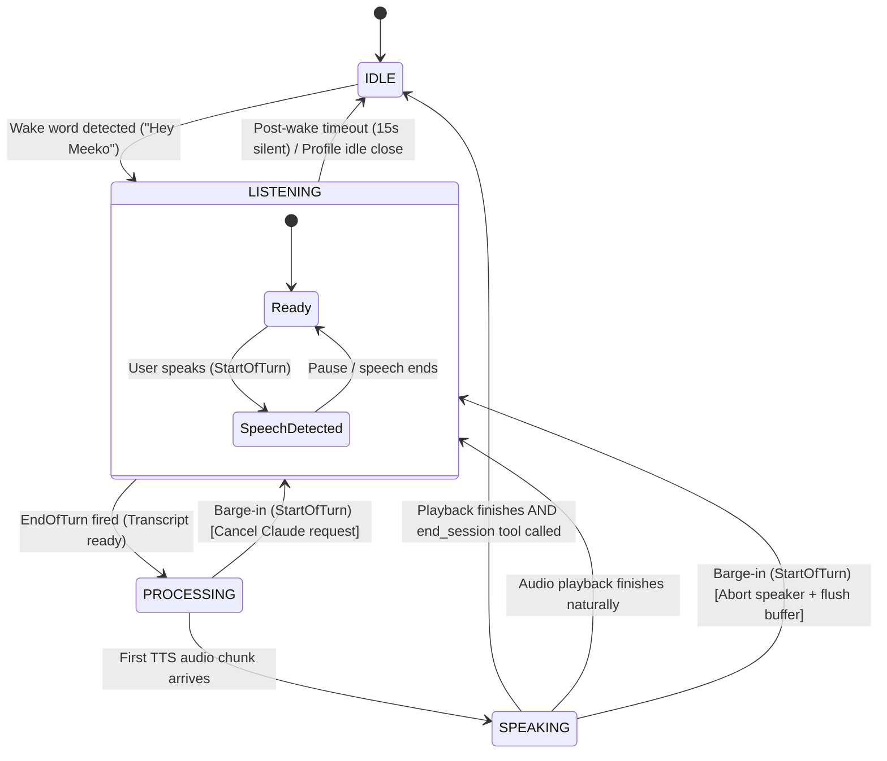
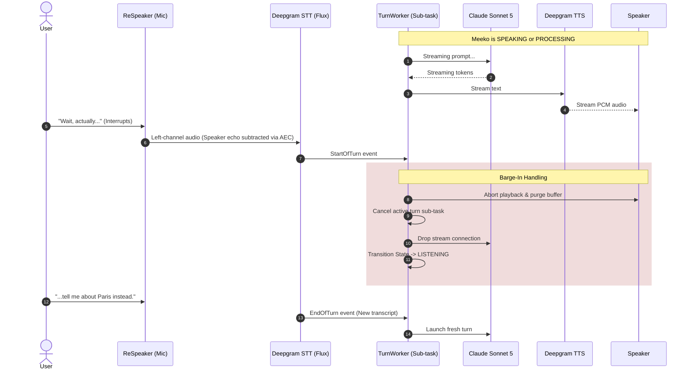

# Meeko Architecture

How Meeko works under the hood — the components, the data flow, and the design decisions behind them. If you just want to install and run Meeko, see [README.md](../README.md) instead.

## 1. Overview

Meeko is a personal voice assistant designed to serve as a long-running brainstorming partner. The core use case is extended, deep conversations — the kind where the user might pause for minutes at a time to think, then resume, or return days later to pick up a prior thread. This is fundamentally different from a command-and-control voice assistant or a customer service bot. Meeko needs to:

- Support conversations that grow to 50k-150k tokens over time
- Allow the user to pause and resume naturally, including across sessions
- Resume prior conversations by voice ("let's go back to the todo app conversation")
- Remain cost-efficient despite large conversation histories
- Feel natural — no rigid command syntax, no jarring interruptions

It also handles quick everyday tasks (one-shot questions, timers, persona switching), but the system is shaped around the long-conversation case; the quick-question case falls out naturally as the short tail.

---

## 2. Architecture Overview


---

## 3. Hardware (tested configurations)

Meeko is hardware-agnostic in principle — anything PyAudio can see for a mic and a speaker will work. The two configurations the maintainer has tested are:

| Configuration | Notes |
|---|---|
| Raspberry Pi 5 (8 GB) + ReSpeaker XVF3800 + powered speaker | The production target. NVMe SSD via HAT recommended (SD cards are too slow for model loading) and active cooling is required under sustained load. |
| macOS laptop with built-in mic and speakers | The development target. Set `mute_mic_while_speaking = true` to compensate for the lack of hardware AEC. |

Other USB mic arrays and Linux hosts should work; you may need to tune `[audio]` device indices and channel counts.

The ReSpeaker XVF3800 deserves a dedicated subsection because of its tight AEC requirements — see §4.1.

---

## 4. Component Details

[meeko/main.py](../meeko/main.py) is the entry point and composition root: `run()` builds every component and injects its dependencies. The orchestration logic those components drive — the state machine, the mic pump, STT event routing, the idle windows, the turn worker and the post-turn session-change hook — lives in the [meeko/orchestrator/](../meeko/orchestrator/) package. The STT connection lifecycle (reconnect, backoff, keepalive) stays in [meeko/stt_supervisor.py](../meeko/stt_supervisor.py), next to the Deepgram client it supervises.

### 4.1 Mic / speaker layer (and the XVF3800)

Audio I/O is implemented with PyAudio (not `sounddevice`) — PortAudio gives direct control over native channel counts, which we need because PortAudio does not silently rate/channel-convert the way macOS CoreAudio does for system apps. Both streams open at the device's native channel count and mono ↔ stereo conversion happens in Python.

**ReSpeaker XVF3800 specifics.** The XVF3800 is a 4-mic USB array powered by the XMOS XVF3800 chip. It performs acoustic echo cancellation (AEC), beamforming, noise suppression, and voice activity detection entirely in hardware. Two configuration details matter:

1. **Speaker must be plugged into the XVF3800's 3.5mm jack**, not the host's audio output. The chip needs the "far end" reference signal to subtract speaker audio from the mic input. Without it, AEC does not work and barge-in becomes impossible.
2. **Take the left channel on input** (channel 0 = AEC-processed output on the XVF3800); duplicate mono TTS to both output channels.

The maintainer also raised `PP_DTSENSITIVE` to `12` and persisted it to flash — see [raspberry-pi-setup.md](raspberry-pi-setup.md) for the exact commands. Without it, the chip's default AEC tuning suppresses near-end speech too aggressively during far-end playback and barge-in stops working.

For other hardware (Mac built-in mic, generic USB mics with no hardware AEC), set `mute_mic_while_speaking = true` so Meeko software-mutes the mic during TTS playback.

### 4.2 Deepgram STT (Flux)

Used for real-time transcription and end-of-turn detection. The Flux model is specifically designed for conversational voice agents — it detects end-of-turn semantically, not just by silence threshold.

**Key events:**
- `StartOfTurn` — user has begun speaking; used to trigger barge-in if a reply is being generated or played
- `EndOfTurn` — user has finished their turn; triggers the Claude API call

What each event *means* depends on the current state, and that decision table lives in `SttEventRouter` ([meeko/orchestrator/stt_events.py](../meeko/orchestrator/stt_events.py)). The cases that matter are the ones that deliberately do nothing: an `EndOfTurn` in IDLE (mic audio is gated behind the wake word, so a stray transcript must not start a conversation), and an `EndOfTurn` in SPEAKING (a barge-in would already have flipped the state to LISTENING, so reaching that branch means the transcript is the assistant's own voice). The router must always drain the event stream — backpressure there parks the websocket's transfer_data task, starves pong frames and trips Deepgram's keepalive watchdog with a 1011 mid-reply — so routing is one synchronous decision per event and the Claude+TTS work happens on the far side of the turn queue.

### 4.3 Claude API (direct)

Meeko calls the Claude API directly — not via Deepgram's managed LLM. This is the central architectural decision that enables prompt caching, server-side compaction, and full session control.

**Model:** `claude-sonnet-5`

**Prompt caching & system prompt prefix.** `cache_control` is stamped on the system prompt block and on the tail block of the latest message at send time. The breakpoint moves forward each turn, so the previous turn's tail becomes the longest cached prefix on the next call. The stable prefix consists of:
1. Current local date and time block (`_date_block`)
2. Optional approximate home coordinates block (`_location_block`, injected when `[location] latitude/longitude` are configured in `meeko.toml`)
3. The active profile's persona system prompt (`_profile_prompt`)

**Server-side compaction.** Enabled via `client.beta.messages.stream(...)` with `betas=["compact-2026-01-12"]` and `context_management={"edits": [{"type": "compact_20260112", "trigger": {"type": "input_tokens", "value": compaction_trigger_tokens}}]}`. The threshold is configured via `[claude] compaction_trigger_tokens` in `meeko.toml` (default `150000`). When the API summarizes a prefix, it returns a `compaction` content block in the assistant message. The client round-trips that block in the in-memory message array (so the server doesn't re-summarize the same prefix on the next turn) and filters it out before SQLite persistence (so on-disk transcripts stay verbatim).

**Web search.** `ClaudeClient` exposes Anthropic's `web_search_20260209` server tool to Sonnet, gated by `[claude] web_search_enabled` (default `true`) and capped at `[claude] web_search_max_uses` *attempts* per turn (default `4`; it is a circuit breaker on searches that hang server-side rather than a quality dial — the measurements are in `meeko/claude_client.py`). Web search is a server-side tool: the model invokes it inside the same streaming turn, emits `server_tool_use` and `web_search_tool_result` blocks, and we round-trip those blocks in the in-memory message array so the cached prefix stays valid. Result blocks are normalized before SQLite persistence so the on-disk transcript stays compact.

`web_search_20260209` also does *dynamic filtering*: Sonnet calls `web_search` from inside a `code_execution` server tool rather than at the top level. Those nested blocks carry a `caller` field (`{"tool_id": <the code_execution id>, "type": "code_execution_20260120"}`) tying them to the call that made them, and `_serialize_block` **must preserve it**. Without `caller` the API can't match the nested searches to their `code_execution` and rejects the request with `` `code_execution` tool use with id ... was found without a corresponding `code_execution_tool_result` block ``. That kills the *next* turn of the session, not the search turn itself — and, since SQLite stores history verbatim, every `--resume` of it too. `tests/test_claude_api_contract.py` covers this end to end.

### 4.4 Deepgram TTS (Aura-2)

Used for speech synthesis. Text is streamed to the TTS WebSocket as Claude generates tokens, and audio is played back in real time with sub-200ms latency to first audio byte. The Aura-2 voice id is per-profile (`voice = "mars"`, `"andromeda"`, etc.) — see §4.7.

### 4.5 Tool Architecture & Session Intents

Meeko exposes external capabilities and session-management intents to Sonnet as Claude-native tools, registered through `ToolDispatcher`:
- **Timers** ([meeko/tools/timer.py](../meeko/tools/timer.py)): `set_timer` with natural language duration, backed by an async background timer loop.
- **Profile switching** ([meeko/tools/profile.py](../meeko/tools/profile.py)): `switch_profile` and `list_profiles` to rotate personas on the fly.
- **Weather** ([meeko/tools/weather.py](../meeko/tools/weather.py)): `get_weather` powered by Open-Meteo (free, no API key required), defaulting to configured home coordinates or reverse-geocoded coordinates for requested places.
- **Session management** ([meeko/tools/session.py](../meeko/tools/session.py)): `end_session`, `new_session`, `list_sessions`, and `load_session`.

Exposing session-management intents as tools rather than detecting them with a separate classifier mirrors the pattern used across all other tools: tools are registered via `ToolDispatcher`, Sonnet decides when to call them based on conversation context, and `ClaudeClient`'s tool-use loop dispatches to the tool's handler when Sonnet emits a `tool_use` block. (For the complete data model, persistence architecture, and resume flow, see §6 and §7.)

**Tools exposed to Sonnet:**

| Tool | Behavior |
|---|---|
| `end_session` | Orchestrator finalizes the current SQLite session, returns state to `IDLE`, and re-arms the wake-word detector. |
| `new_session` | Finalize current session, reset in-memory message array, create a fresh SQLite session row, continue in `LISTENING`. |
| `list_sessions(query, since, until)` | FTS search across `title + summary + transcript` (BM25-weighted so title/summary matches rank above transcript), and/or a `last_active` date range. At least one argument is required. Returns top N matches as the tool result. |
| `load_session(id)` | Special dispatch semantics — see below. |

**Confirmation UX.** Profiles' system prompts instruct Sonnet to acknowledge verbally before destructive actions. *"I found the todo app session from Tuesday — want to pick that up?"* The confirmation flow is expressed as prompt guidance + the natural turn loop, not as a hard-coded state machine in the orchestrator.

**Cache behavior.** Tool definitions are stable across turns and sit inside the cached prefix. Tool-result blocks are appended to the message array and are themselves cached on subsequent turns. No additional caching hooks required.

**The `load_session` hook.** `load_session` is the one tool whose side effect rewrites Sonnet's own context. When dispatched:

1. The normal tool handler runs, sets a `request_load(target_id)` flag, and returns the stored transcript metadata.
2. After Sonnet's verbal confirmation/wrap-up is fully spoken (SPEAKING ends), the post-turn hook fires the abandoned session's summary in the background, calls `store.load_turns(target_id)`, swaps the in-memory message array via `claude.load_history`, and `claude.rebind_session(target_id)`.
3. Subsequent turns hit the cache with the injected history (one-time cache-write cost on the first post-load turn).

See `apply_post_turn_session_change` in [meeko/orchestrator/session_change.py](../meeko/orchestrator/session_change.py), which `TurnWorker` ([meeko/orchestrator/turn_worker.py](../meeko/orchestrator/turn_worker.py)) calls once each turn's speech has finished.

### 4.6 Wake-word gating

On startup Meeko sits in `IDLE` with the mic open, but audio is fed to an [openWakeWord](https://github.com/dscripka/openWakeWord) detector running on-device (ONNX) instead of Deepgram STT. Saying "Hey Meeko" transitions the session to `LISTENING`, after which mic audio flows to Deepgram normally — the gate is **one-shot per session**, follow-up turns do not require re-waking. After `end_session`, the detector is reset and the session returns to `IDLE`.

The gate is enforced in `MicPump` ([meeko/orchestrator/mic_pump.py](../meeko/orchestrator/mic_pump.py)), which decides per 50ms chunk whether it goes to the detector or to Deepgram. Nothing is streamed off-device before the wake word fires, and the chunk that fires it isn't forwarded either — it holds the wake phrase, not the question. The same pump implements the `mute_mic_while_speaking` drop (§4.1) for hosts without hardware AEC.

Configuration lives in `[wake_word]` in `meeko.toml`. Defaults: model `models/hey_meeko.onnx`, threshold `0.96`. First run downloads openWakeWord's melspectrogram, embedding and VAD models (~6.7 MB; its six bundled wake words are suppressed, see [wake-word.md](wake-word.md)).

### 4.7 Profiles and idle behavior

Meeko runs under one of several **profiles** defined in `[profiles.<name>]` tables in `meeko.toml`. A profile is a (persona, voice, idle-timing) bundle:

- `prompt` — the system prompt that defines the persona (required)
- `voice` — Aura-2 voice id (optional; defaults to `asteria`)
- `description` — one line telling Sonnet when to switch to this profile (optional)
- `idle_timeout_seconds`, `idle_prompt`, `idle_close_seconds`, `idle_close_text`, `post_wake_timeout_seconds`

**Profile names are free-form and carry no behavior.** No code branches on a profile's name; everything that differs between profiles is a key in its table. A top-level `default_profile = "<name>"` key selects which one a fresh session starts in and is required.

The shipped config provides two: `query` (terse one- to two-sentence replies, silent close) and `conversation` (substantive thinking-partner persona, spoken check-in). Users call them "modes", and the `switch_profile` tool description tells Sonnet so.

**Post-turn idle behavior** is one code path, `run_idle_window` ([meeko/orchestrator/idle.py](../meeko/orchestrator/idle.py)), shaped by four keys. After `idle_timeout_seconds` of silence in LISTENING: if `idle_prompt` is set, speak it and wait `idle_close_seconds` more (timed from when the check-in *finishes*, so Meeko's own talking doesn't eat into the user's response time); then, if `idle_close_text` is set, speak it; then end the session. The two shipped profiles are the two natural points in that space:

| Shipped profile | Keys | Behavior |
|---|---|---|
| `query` | defaults only | After 5s of silence, close silently. Optimized for one-shot questions. |
| `conversation` | all four set | After 60s, "Still thinking, or should we wrap up?"; after 20s more, "Ending the session now. Talk later." and close. Pauses are first-class. |

This used to be two hardcoded modes selected by the profile name, which is why names were once restricted to `query` and `conversation`. Collapsing the modes into config is what lets a user add a third profile without touching code.

**Post-wake timeout.** `post_wake_timeout_seconds` (default `15.0`) is a separate silence window covering the gap between the wake word firing and the user's *first* turn — the "Hey Meeko" that nobody follows up on. It ignores the `idle_*` keys: on expiry the session always closes silently and returns to IDLE, requiring a fresh wake word. Non-positive disables it. Both windows are owned by `IdleController` ([meeko/orchestrator/idle.py](../meeko/orchestrator/idle.py)), which arms them (`start_post_wake` / `start_post_turn`) and shares one task slot between them, so every teardown path — user activity, barge-in, the next turn, shutdown — is a single `cancel()`.

**Voice-driven profile switching.** Profile changes are exposed to Sonnet as the `switch_profile` and `list_profiles` tools. The `switch_profile` description is built from the loaded profiles — one line per profile, from its `description` key ([meeko/tools/profile.py](../meeko/tools/profile.py)) — so Sonnet can match both "switch to conversation mode" and indirect asks like "let's have a long conversation" to a profile, including user-added ones. It calls `switch_profile(profile_name=...)`; the new system prompt is bound on the next Claude call and the new profile's idle behavior takes effect on the next turn. The active profile persists for the rest of the session, and the switch is also written to the session's `profile_name` in SQLite, so `--resume` and `load_session` bring the session back in the profile it was left in, not the one it started in. (`_build_dispatcher` in [meeko/main.py](../meeko/main.py) wraps the profile tools to do this; the write is best-effort, since the in-memory switch has already been confirmed to the user.)

### 4.8 Session Manager & Background Scheduling

The Session Manager coordinates immediate turn persistence to SQLite and delegates end-of-session summarization to `SummaryScheduler` ([meeko/session_summary.py](../meeko/session_summary.py)). Summarization runs asynchronously in the background so that session teardown and wake cycles never block. `SummaryScheduler` also backfills any unsummarized sessions on startup and guarantees clean task draining via `aclose()` before database shutdown. Full data models, FTS5 indexing, and resume workflows are covered in §6.

### 4.9 LED Controller & Visual State Mirror

On-device visual feedback is driven by `LedController` ([meeko/leds.py](../meeko/leds.py)) for the ReSpeaker XVF3800's WS2812 LED ring. To ensure the hardware ring can never disagree with the orchestrator, `StateManager` ([meeko/orchestrator/state.py](../meeko/orchestrator/state.py)) is the sole caller that updates LEDs synchronously on every state transition:
- **`IDLE`**: Off
- **`LISTENING`**: Solid cyan ("ready" cue)
- **`LISTENING_ACTIVE`**: Bright cyan (active speech detected)
- **`PROCESSING`**: Blue breathing pattern (waiting on Claude / TTS)
- **`SPEAKING`**: Solid green (audio playing through speaker)
- **Errors**: Red breathing pattern (~3 seconds)

LED communication runs over direct USB vendor control transfers via `libusb` / `pyusb` without requiring root permissions (via `scripts/99-meeko-xvf3800.rules`). LED control is automatically disabled on unsupported hosts or when `led_disabled = true` in `meeko.toml`.

---

## 5. Conversation Flow

### 5.1 State Machine



*(Note: When user speech is actively detected during `LISTENING`, Meeko enters an internal `LISTENING_ACTIVE` sub-state to drive live visual indicators like the brighter cyan LED ring, before transitioning to `PROCESSING` once `EndOfTurn` fires.)*

### 5.2 Normal Turn Lifecycle

1. `EndOfTurn` fires with finalized transcript.
2. Call Claude API with current message array and registered tool definitions.
3. If Sonnet emits one or more `tool_use` blocks, dispatch each through `ToolDispatcher` and append `tool_result` blocks to the message array; re-call Claude until no more tool calls.
4. Append user message and final Claude response to:
   - In-memory message array (for Claude context)
   - On-disk SQLite transcript (persistent source of truth)
5. Stream Claude response text to Deepgram TTS.
6. Play audio through the speaker.
7. If `end_session` was called during this turn, transition to IDLE and re-arm the wake detector; otherwise return to LISTENING and start the idle monitor for the active profile.

### 5.3 Barge-In

1. `StartOfTurn` fires while state is SPEAKING **or PROCESSING**.
2. Immediately stop TTS audio playback.
3. Cancel in-flight Claude API request if possible.
4. Discard any partially generated response.
5. Transition to LISTENING.
6. Process user's barge-in as a new turn.



The PROCESSING case matters as much as the SPEAKING one: the window between `EndOfTurn` and the first audio byte (Claude TTFT + Deepgram TTS first-byte synthesis) is often over a second, and `Speaker` deliberately defers entering SPEAKING until that first chunk arrives so the LEDs don't claim to be talking before there's audio. A user who changes their mind during that gap is barging in on a reply that exists but isn't audible yet, and is handled identically.

Hardware AEC (on the XVF3800) ensures Deepgram STT does not hear speaker audio as user speech. `StartOfTurn` events during TTS playback are therefore genuine barge-ins, not echo artifacts. On hardware without AEC, software mic-muting (`mute_mic_while_speaking = true`) provides the equivalent guarantee at the cost of disallowing barge-in.

Barge-in is implemented in `TurnWorker` ([meeko/orchestrator/turn_worker.py](../meeko/orchestrator/turn_worker.py)), the long-lived consumer of the turn queue. Each Claude+TTS turn runs as its own sub-task, so `request_barge_in()` can cancel that turn without stopping the worker. The worker lives at `run()` scope, outside the per-STT-session workers, so an STT reconnect mid-reply doesn't cut TTS off. A barge-in cancel and a shutdown cancel both reach the worker as a `CancelledError` from the turn. The first must leave the worker running and the second must propagate, and a flag set by `request_barge_in()` before it cancels is the only thing that tells them apart. `stop_event` can't be used, because asyncio's shutdown cancels the worker before `run()`'s `finally` sets it. `request_barge_in()` also switches to LISTENING synchronously, with or without a turn to cancel, because `SttEventRouter` handles the `EndOfTurn` that follows without yielding, and in SPEAKING that transcript would be dropped as echo.

---

## 6. Session Management

### 6.1 Data Model (SQLite)

```sql
CREATE TABLE sessions (
    id            TEXT PRIMARY KEY,     -- UUID
    profile_name  TEXT NOT NULL,        -- profile active when last used
    title         TEXT,                 -- generated at session end
    summary       TEXT,                 -- generated at session end
    created_at    TEXT NOT NULL,        -- ISO 8601
    last_active   TEXT NOT NULL         -- ISO 8601
);

CREATE TABLE turns (
    id          INTEGER PRIMARY KEY AUTOINCREMENT,
    session_id  TEXT NOT NULL REFERENCES sessions(id),
    role        TEXT NOT NULL,          -- 'user' or 'assistant'
    content     TEXT NOT NULL,          -- JSON-encoded: str for user speech,
                                         -- list[block] for assistant / tool_result rounds
    timestamp   TEXT NOT NULL           -- ISO 8601
);

CREATE INDEX idx_turns_session ON turns(session_id, id);

-- Standalone FTS5 table (not content=sessions — external content FTS5
-- uses INTEGER rowid linkage, but sessions.id is a TEXT UUID).
-- Populated once per session by end-of-session summarization.
-- Transcript column stores the flattened turn log for fallback recall
-- when the summarizer didn't highlight a specific keyword.
CREATE VIRTUAL TABLE sessions_fts USING fts5(
    session_id UNINDEXED,
    title,
    summary,
    transcript
);
```

### 6.2 Turn Persistence

Turns are written to SQLite immediately on completion — not buffered and not dependent on session end. This ensures:

- No data loss if Meeko crashes or the host loses power.
- The on-disk transcript is always the source of truth.
- Server-side compaction can freely modify the in-memory message array without data loss.

### 6.3 End-of-Session Summary

When a session ends, a separate Claude API call generates a `{title, summary}` pair from the full on-disk transcript. This is independent of whatever state compaction has left the in-memory message array in. The transcript is written to `sessions_fts.transcript` alongside `title` and `summary` so FTS search has a fallback match surface when the summarizer misses a specific keyword the user later recalls.

**Model choice.** Summarization runs on `claude-sonnet-5`, not Haiku. Sessions routinely grow to 50k-150k tokens, and summary quality directly drives voice-resume recall — a weak title means the user says *"go back to the todo app"* and FTS misses. The call is once per session and runs in the background, so Haiku's cost/latency advantages don't apply.

**Background scheduling.** Summarization tasks are managed by `SummaryScheduler` ([meeko/session_summary.py](../meeko/session_summary.py)). Rather than coupling summarization to the orchestrator's wake/turn loop, the scheduler launches tasks in the background (`fire()`), tracks in-flight executions, runs an automatic startup backfill (`backfill()`) for any prior sessions left unsummarized due to an ungraceful shutdown, and drains cleanly at exit (`aclose()`) before the database closes.

**Not yet implemented: chunking.** The whole transcript is sent in one call. A transcript that exceeds Sonnet's context window errors, and since summarization is fire-and-forget the failure is logged and skipped — the session simply never gets a title or an FTS row, so it can't be recalled by voice. Splitting into chunks, summarizing each, then summarizing the summaries is the intended fix; at personal-use volumes it hasn't been worth building yet. See the note at the top of [meeko/session_summary.py](../meeko/session_summary.py).

### 6.4 Session Resume Flow

Resume is driven by Sonnet calling the `list_sessions` and `load_session` tools — the same flow works whether the request comes on the first utterance after wake or mid-conversation.

1. User expresses resume intent ("let's go back to the todo app", at session start or mid-conversation).
2. Sonnet calls `list_sessions(query="todo app")`. The `list_sessions` handler runs SQLite FTS5 against title + summary + transcript (BM25-weighted so title/summary outrank transcript matches), returns top N matches as the tool result.

   `list_sessions` also takes an optional `since`/`until` date range, for "what did we talk about yesterday?" style asks. Sonnet passes local `YYYY-MM-DD` dates (it is told today's local date every turn via the system prompt's date block) and the handler converts them to UTC for comparison against `last_active`. The date-only path deliberately queries the `sessions` table rather than `sessions_fts`, so sessions that haven't been summarized yet still show up — otherwise "what did we discuss today?" would miss the conversation that just ended.
3. Sonnet asks for confirmation verbally: *"I found the todo app session from Tuesday — shall I load it?"* (one clear match) or reads top 2-3 titles (multiple matches).
4. On user confirmation, Sonnet calls `load_session(id=...)`. The post-turn hook (`apply_post_turn_session_change`) automatically fires end-of-session summarization for the abandoned session in the background, so Sonnet does not need to chain `end_session` first.
5. The same hook's `load_session` branch (§4.5) loads the full transcript, replaces the in-memory message array, and rebinds `ClaudeClient` to the loaded session's SQLite row before the next user turn triggers a Claude call.
6. Conversation continues in the loaded session's context.

**Cost note.** Injecting a large transcript on resume incurs a one-time cache write cost on the first turn (~1.25× normal input price). Subsequent turns in that session hit the cache at 10% of normal input price.

---

## 7. Prompt Guidance for Session Tools

Each profile's system prompt includes guidance directing Sonnet to:

- Call `end_session` when the user clearly indicates they want to stop ("stop", "goodnight", "that's enough for today", "let's pick this up later"). `end_session` is called silently — Meeko turns off without a verbal goodbye. Do not call it when the user is ambiguous or immediately walks back the signal.
- Call `list_sessions` when the user asks about prior conversations or wants to resume one.
- Confirm verbally before destructive actions — especially `load_session` (which abandons the current context) and `new_session` (which discards the current thread).

**Example phrases Sonnet should treat as end-session signals:** "I think that's enough for today", "let's stop here", "save this", "goodnight", "Meeko stop".

**Example phrases that should NOT trigger `end_session`:** "stop interrupting me", "that's enough about X, let's talk about Y", "I was going to stop but…".

The fine-grained call/don't-call judgment is Sonnet's — the system prompt gives the policy, and Sonnet has full conversation context to apply it.

---

## 8. Key Decisions

### Why call Claude directly instead of using Deepgram's managed Claude?

Deepgram's Voice Agent API manages the Claude API calls internally, which means there is no way to add `cache_control` headers, enable auto compaction, or control what gets injected on session resume. For Meeko's use case — long conversations with persistent sessions — these features are essential. The cost of forgoing them (ever-growing token costs, no compaction, shallow resume) outweighs the convenience of the managed integration.

### Why use Deepgram for STT at all, rather than Whisper or similar?

Deepgram's Flux model provides end-of-turn detection that is semantically aware — it distinguishes a mid-thought pause from an actual turn completion. This is a genuinely hard problem to solve well. Building equivalent quality turn detection from scratch would be a significant project. Flux gives it for free as part of the STT API.

### Why store turns immediately rather than at session end?

Server-side compaction modifies the in-memory message array during long sessions — early turns get replaced by a summary. If turns were only persisted at session end, those early turns would be lost. Writing to SQLite on every turn ensures the on-disk transcript always contains the full verbatim history regardless of what compaction has done in memory.

### Why keep both full transcript and summary per session?

The summary is used for resume matching — it's fast to search and compact enough to pass to Claude for disambiguation. The full transcript is used for the actual resume — injecting the summary alone would lose the nuance that makes brainstorming sessions valuable. They serve different purposes.

### Why Claude tool-use for session management rather than a two-stage intent classifier?

An earlier draft proposed a keyword filter + Haiku classifier running on every turn to detect session-management intents. We chose tool-use instead:

- **Context awareness:** Sonnet sees the full conversation; a per-turn classifier sees one turn in isolation. Ambiguous phrasings ("that's enough about X, let's talk about Y", "I was going to stop but…") are exactly where an isolated classifier breaks. Sonnet gets the nuance right.
- **Cost:** Session commands are rare (≈once per session). With prompt caching at ~90% input discount on cached prefixes, the cost of routing session intents through Sonnet is negligible.
- **Latency:** Session commands aren't time-critical — an extra ~1s on "goodnight" doesn't meaningfully affect UX.
- **Reliability:** One code path, one failure mode. Two-stage has two (keyword miss, Haiku miss).
- **Mid-conversation resume** falls out naturally when `list_sessions` / `load_session` are tools — Sonnet chains them inside a single turn. The two-stage framework would need a dedicated out-of-loop flow.

The one operational wrinkle — `load_session` replaces Sonnet's own message array — is handled as a single post-dispatch hook (§4.5).

### Why the ReSpeaker XVF3800's 3.5mm jack for the speaker?

The XVF3800 performs acoustic echo cancellation using a reference signal — the audio being played through the speaker. For hardware AEC to work, the speaker audio must reach the chip as a reference. Plugging the speaker into the 3.5mm jack on the XVF3800 provides this reference automatically. Without it, the microphones pick up speaker audio as user speech, causing false `StartOfTurn` events and hallucinated transcriptions.

### Why not use Deepgram's built-in echo cancellation?

Deepgram's documentation defers echo cancellation to the browser's WebRTC stack or telephone hardware. In a Python process on a Pi or laptop, neither is available. Hardware AEC (XVF3800) or software mic-muting (`mute_mic_while_speaking`) handle this instead.

---

## 9. Deliberate Scope

Meeko is intentionally a voice-only, single-user, single-device assistant. Features explicitly out of scope for now: web or mobile UI, multi-user support, semantic search over sessions (SQLite FTS5 is sufficient at expected volumes), session deletion or editing by voice, cross-device sync. These omissions keep the system small enough to reason about end-to-end; revisit any of them if real-world usage shows a clear need.
